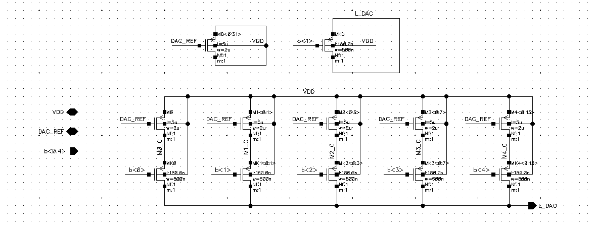

# Operation Amplifier with bandwidth control
The goal of the project was to implement an amplifier circuit in a voltage follower configuration with bandwidth control using a digital-to-analog converter (DAC).

## Miller CMOS OTA

The core of the design is a **two-stage Miller OTA** (Operational Transconductance Amplifier). The first stage of an OTA is with a current mirror load. The second stage implemented in a common-source configuration. Feedback  in the circuit is provided by a compensation capacitor C_c with resistor in series. Resitstor cancels the effect of feedforward which is the cause of positive zero appearing in frequencyr response.

## Bandwidth control
Bandwidth control is achieved by adjusting the position of the dominant and non-dominant poles. The project utilizes the relatioship between pole positions and transconductance of amplifier stages. The transconductance of each stage is manipulated using the output current of the DAC. This current is copied to both amplifier stages through a current mirror bank.

## DAC

