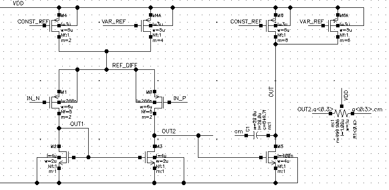

# Operation Amplifier with bandwidth control
The goal of the project was to implement an amplifier circuit in a voltage follower configuration with bandwidth control using a digital-to-analog converter (DAC).

## Miller CMOS OTA

The core of the design is a **two-stage Miller OTA** (Operational Transconductance Amplifier). The first stage of an OTA is with a current mirror load. The second stage implemented in a common-source configuration. Feedback  in the circuit is provided by a compensation capacitor C_c

