# Operation Amplifier with bandwidth control
The objective of this project was to design and implement an amplifier circuit in a voltage follower configuration with bandwidth control utilizing a digital-to-analog converter (DAC). The targeted tuning range was between 15 MHz and 20 MHz for the smallest possible bandwidth and 60 MHz to 70 MHz for the largest. Additionally, the phase margin was required to be within the range of 60° to 70°.

## Miller CMOS OTA

The core of the design is a **two-stage Miller OTA** (Operational Transconductance Amplifier). The first stage of an OTA is with a current mirror load. The second stage implemented in a common-source configuration. Feedback  in the circuit is provided by a compensation capacitor C_c with resistor in series. Resitstor cancels the effect of feedforward which is the cause of positive zero appearing in frequencyr response.

## Bandwidth control
Bandwidth control is achieved by adjusting the position of the dominant and non-dominant poles. The project utilizes the relatioship between pole positions and transconductance of amplifier stages. The transconductance of each stage is manipulated using the output current of the DAC. This current is copied to both amplifier stages through a current mirror bank.

### DAC
The DAC operates by switching key transistors on and off based on the bits of the input value b<0:4>. Each activated transistor allows current to flow from its corresponding current source, and the total output current is the sum of all these individual currents.

For the current to match correctly, all current sources must experience the same resistance. To achieve this, the number of key transistor instances for each bit is equal to the number of current source instances

## Full Schematic
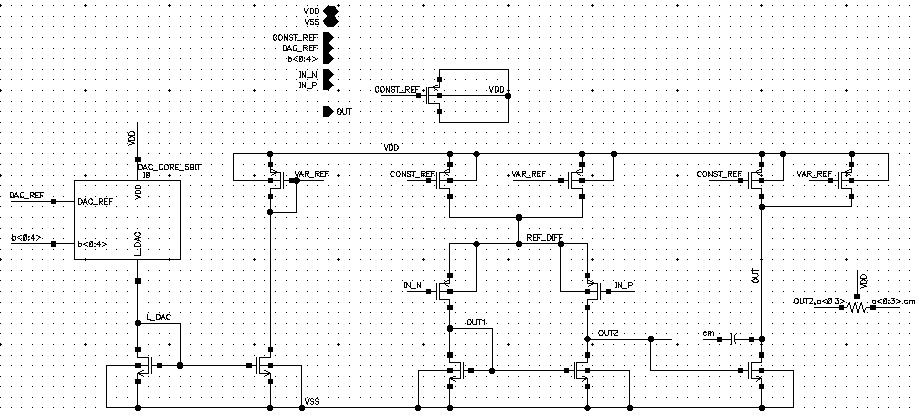

## Layout
### Full layout
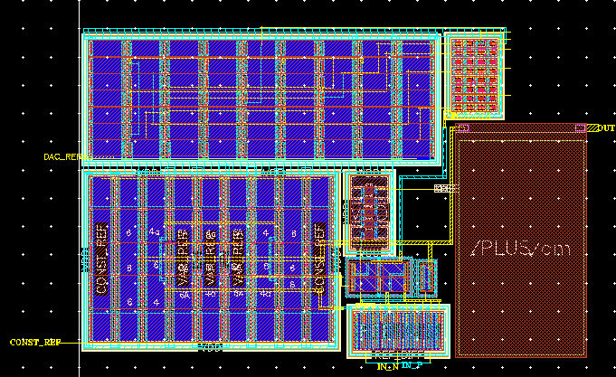

### Current Mirror and CS stage layout
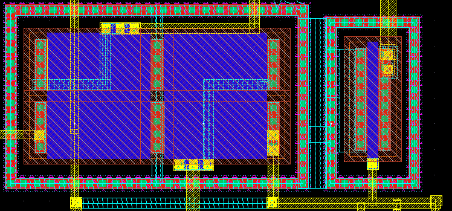

### Differential Pair layout
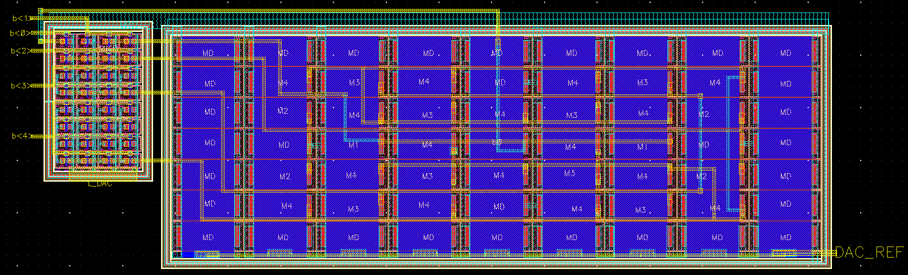

### DAC layout
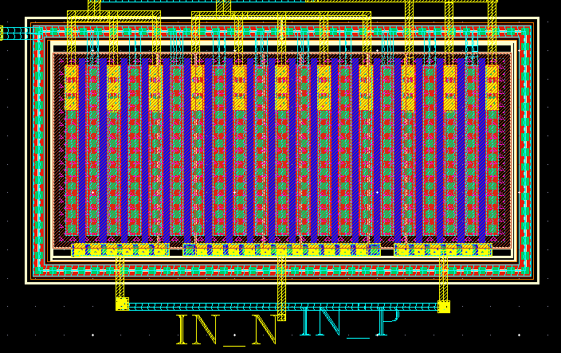

## Simulations Results
## Output Transfer Characteristics vs. Input Voltage
### Open Loop
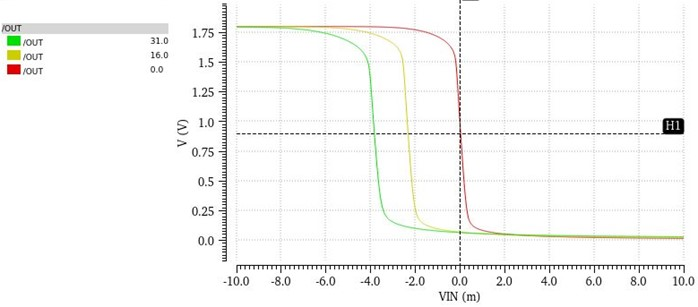
### Closed Loop
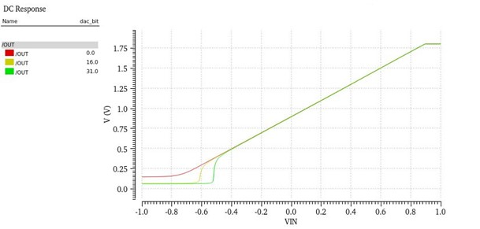

##Phase Margin vs dac_bit
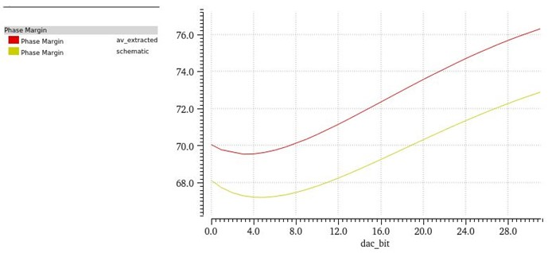

##Bandwidth vs dac_bit
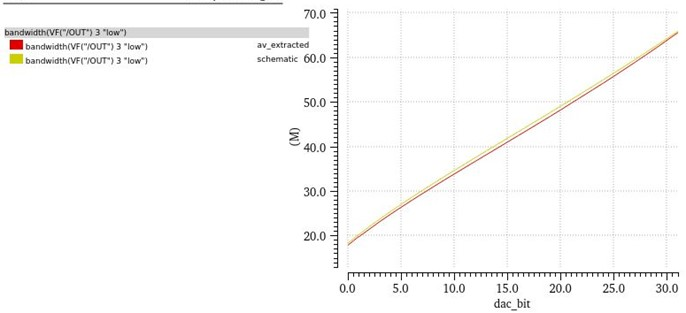

## Power Consumption
### schematic level simulation
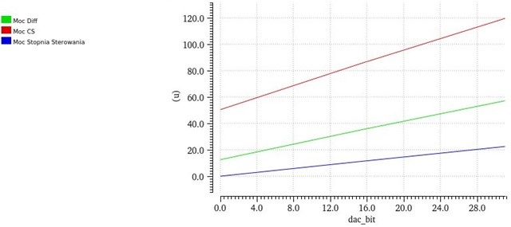
### post-layout level simulation
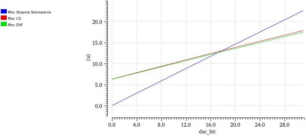

